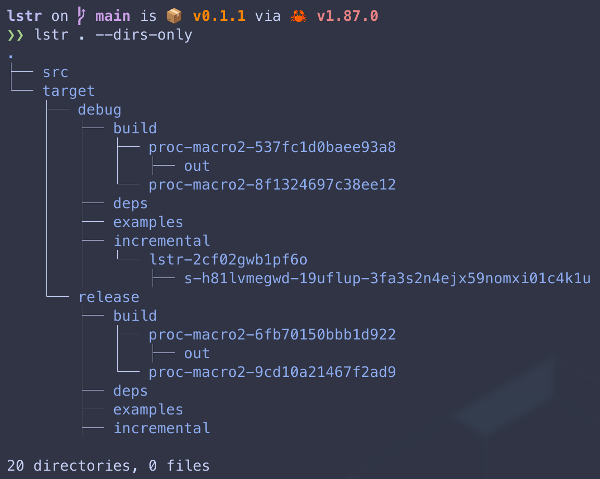

# lstr

A blazingly fast, minimalist directory tree viewer, written in Rust.

`lstr` (`LiSt-TRree`) walks a directory and prints its contents in a tree structure. It is designed with the Unix philosophy in mind: do one thing and do it well, with a focus on speed and simplicity.

 
*(Note: You will need to replace this with an actual screenshot URL after you run it)*

## Philosophy

-   **Fast:** Written in Rust for maximum performance and memory efficiency.
-   **Minimalist:** Provides essential features without the bloat. The core experience is clean and uncluttered.
-   **Authentic:** Adheres to the spirit of classic command-line utilities.

## Features

-   Recursive directory listing with a visual tree structure.
-   Configurable colorized output for easy identification (`--color`).
-   Control listing depth (`-L`).
-   Option to list directories only (`-d`).
-   Support for showing hidden files (`-a`).

### Color Output

Color is enabled by default for interactive terminals. To disable color, set the `NO_COLOR` environment variable.

```bash
# This command will have no colored output
NO_COLOR=1 lstr
```

## Installation

You need the Rust toolchain installed on your system to build `lstr`.

1.  **Clone the repository:**
    ```bash
    git clone [https://github.com/your-username/lstr.git](https://github.com/bgreenwell/lstr.git)
    cd lstr
    ```

2.  **Build and install using Cargo:**
    ```bash
    cargo install --path .
    ```
    This will compile `lstr` and place the binary in your Cargo binary path (`~/.cargo/bin`), making it available from anywhere in your terminal.

## Usage

```
lstr [OPTIONS] [PATH]
```

### **Arguments:**

-   `[PATH]`
    -   The directory path to list. Defaults to the current directory (`.`).

### **Options:**

-   `--color <WHEN>`
    -   Specify when to use color output.
    -   `always`: Always use color, even when piping to a file.
    -   `auto`: Use color only when printing to a terminal (default).
    -   `never`: Never use color.

-   `-L, --level <LEVEL>`
    -   Maximum depth to descend.

-   `-d, --dirs-only`
    -   List directories only, ignoring all files.

-   `-a, --all`
    -   List all files and directories, including hidden ones.

-   `-h, --help`
    -   Show the help message.

-   `-V, --version`
    -   Show the version information.

## Future Improvements

`lstr` is a living project. Future enhancements could include:
-   Gitignore awareness (`-g` flag).
-   File size display (`-s` flag).
-   Permissions and metadata display.
-   Optimized parallel directory traversal for massive directories.

## Inspiration

The philosophy and functionality of `lstr` are heavily inspired by the excellent C-based `tree` project from [Old-Man-Programmer](https://github.com/Old-Man-Programmer/tree). This project is an attempt to recreate that classic utility in modern, safe Rust. (It's also an excuse to learn rust!)
