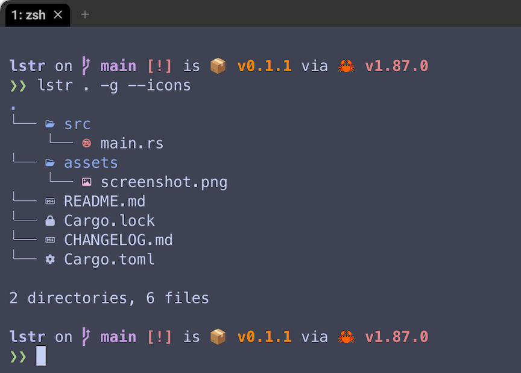

# lstr

[](https://crates.io/crates/lstr)
[](CHANGELOG.md)

A blazingly fast, minimalist directory tree viewer, written in Rust. Inspired by the command line program [tree](https://github.com/Old-Man-Programmer/tree), with a powerful interactive mode.


*An interactive overview of **lstr**'s project structure... using **lstr**.*

## Philosophy

  - **Fast:** Runs directory scans in parallel by default to maximize speed on modern hardware.
  - **Minimalist:** Provides essential features without the bloat. The core experience is clean and uncluttered.
  - **Interactive:** An optional TUI mode for fluid, keyboard-driven exploration.

-   **High-performance:** Scans directories in parallel to be as fast as possible.
-   **Classic and interactive modes:** Use `lstr` for a classic `tree`-like view, or launch `lstr interactive` for a fully interactive TUI.
-   **Rich information display (optional):**
    -   Display file-specific icons with `--icons` (requires a Nerd Font).
    -   Show file permissions with `-p`.
    -   Show file sizes with `-s`.
    -   Git status integration (coming soon).
-   **Smart filtering:**
    -   Respects your `.gitignore` files with the `-g` flag.
    -   Control recursion depth (`-L`) or show only directories (`-d`).

## Installation

You need the Rust toolchain installed on your system to build **lstr**.

1.  **Clone the repository:**

    ```bash
    git clone [https://github.com/bgreenwell/lstr.git](https://github.com/bgreenwell/lstr.git)
    cd lstr
    ```

2.  **Build and install using Cargo:**

    ```bash
    # This compiles in release mode and copies the binary to ~/.cargo/bin
    cargo install --path .
    ```

    Once published, it can be installed with `cargo install lstr`.

Developer: lstr
Custom Gem

Show thinking
Of course. It's a great idea to refactor the documentation for clarity and impact. A clean README.md makes a project much more approachable.

Based on the version of the README.md you provided, here is a revision of the Features and Usage sections to be more consistent and clear, as you requested.

README.md (Revised Sections)
Markdown

# lstr

[](https://crates.io/crates/lstr)
[](CHANGELOG.md)

A blazingly fast, minimalist directory tree viewer, written in Rust. Inspired by the command line program [tree](https://github.com/Old-Man-Programmer/tree).


*A clean overview of a project's structure, with specific Nerd Font icons for file types like Rust (``), Cargo configs (``), and licenses (``).*

## Philosophy

-   **Fast:** Runs directory scans in parallel by default to maximize speed on modern hardware.
-   **Minimalist:** Provides essential features without the bloat. The core experience is clean and uncluttered.
-   **Authentic:** Adheres to the spirit of classic command-line utilities.

## Features

-   **High-Performance:** Scans directories in parallel to be as fast as possible.
-   **Classic and Interactive Modes:** Use `lstr` for a classic `tree`-like view, or launch `lstr interactive` for a fully interactive TUI.
-   **Rich Information Display (Optional):**
    -   Display file-specific icons with `--icons` (requires a Nerd Font).
    -   Show file permissions with `-p`.
    -   Show file sizes with `-s`.
    -   Git status integration (coming soon).
-   **Smart Filtering:**
    -   Respects your `.gitignore` files with the `-g` flag.
    -   Control recursion depth (`-L`) or show only directories (`-d`).

## Installation

You need the Rust toolchain installed on your system to build **lstr**.

1.  **Clone the repository:**

    ```bash
    git clone [https://github.com/your-username/lstr.git](https://github.com/your-username/lstr.git)
    cd lstr
    ```
   

2.  **Build and install using Cargo:**

    ```bash
    # This compiles in release mode and copies the binary to ~/.cargo/bin
    cargo install --path .
    ```
   
## Usage

```bash
lstr [OPTIONS] [PATH]  # or [PATH] [OPTIONS]
lstr interactive [OPTIONS] [PATH]  # or [PATH] [OPTIONS]
```
Note that `PATH` defaults to the current directory (`.`) if not specified.

| Option | Description |
| :--- | :--- |
| `-a`, `--all` | List all files and directories, including hidden ones. |
| `--color <WHEN>` | Specify when to use color output (`always`, `auto`, `never`). |
| `-d`, `--dirs-only`| List directories only, ignoring all files. |
| `-g`, `--gitignore`| Respect `.gitignore` and other standard ignore files. |
| `--icons` | Display file-specific icons; requires a [Nerd Font](https://www.nerdfonts.com/). |
| `-L`, `--level <LEVEL>`| Maximum depth to descend. |
| `-p`, `--permissions`| Display file permissions (Unix-like systems only). |
| `-s`, `--size` | Display the size of files. |
| `--expand-level <LEVEL>`| **Interactive mode only:** Initial depth to expand the interactive tree. |

-----

## Interactive mode

Launch the TUI with `lstr interactive [OPTIONS] [PATH]`.

### Keyboard controls

| Key(s) | Action |
| :--- | :--- |
| `↑` / `k` | Move selection up. |
| `↓` / `j` | Move selection down. |
| `Enter` | **Context-aware action:**<br/>- If on a file: Open it in the default editor (`$EDITOR`).<br/>- If on a directory: Toggle expand/collapse. |
| `q` / `Esc` | Quit the application normally. |

## Examples

**1. List the contents of the current directory**

```bash
lstr
````

**2. Explore a project interactively, ignoring gitignored files**

```bash
lstr interactive -g --icons
```

**3. Display a directory with file sizes and permissions (classic view)**

```bash
lstr -sp
```

**4. Start an interactive session with all data displayed**

```bash
lstr interactive -g --icons -s -p
```

## Piping and Shell Interaction

The classic `view` mode is designed to work well with other command-line tools via pipes (`|`).

### Interactive Fuzzy Finding with **fzf**

This is a powerful way to instantly find any file in a large project.

```bash
lstr -a -g --icons | fzf
```

**fzf** will take the tree from **lstr** and provide an interactive search prompt to filter it.

### Paging Large Trees with less or bat

If a directory is too large to fit on one screen, pipe the output to a *pager*.

```bash
# Using less (the -R flag preserves color)
lstr -L 10 | less -R

# Using bat (a modern pager that understands colors)
lstr --icons | bat
```

## Performance and concurrency

By default, **lstr** uses a parallel directory walker to maximize speed on multi-core systems. This parallelism is managed by the excellent [rayon](https://crates.io/crates/rayon) thread pool, which is used internally by **lstr**'s directory traversal engine.

For advanced use cases, such as benchmarking or limiting CPU usage, you can control the number of threads by setting the `RAYON_NUM_THREADS` environment variable before running the command.

**To force single-threaded (serial) execution:**

```bash
RAYON_NUM_THREADS=1 lstr .
```

## Inspiration

The philosophy and functionality of **lstr** are heavily inspired by the excellent C-based [tree](https://github.com/Old-Man-Programmer/tree) command line program. This project is an attempt to recreate that classic utility in modern, safe Rust.